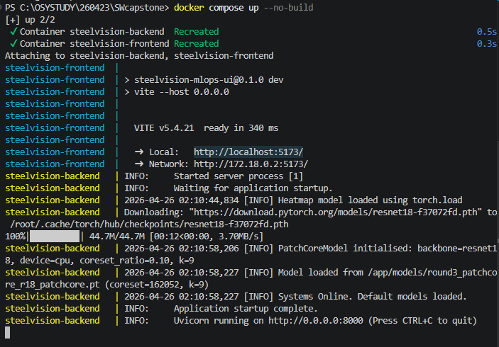

# 사용 방법

1. docker desktop 프로그램을 설치 후 실행한다.

2. 터미널에서 SWCapstone 폴더로 이동한다. (예시) cd C:\OSYSTUDY\260423\SWcapstone

3. docker compose build frontend

4. docker compose build backend

5. docker compose up --no-build 

6. http://localhost:5173/ 로 접속한다.

# 참고 사항

1. docker compose build backend 하실 때 오류가 생기는데요, 임시로 backend폴더 안에다가 비어있는 폴더를 새로 만들어주시면 됩니다. (예시) C:\OSYSTUDY\260423\SWcapstone\backend\models
