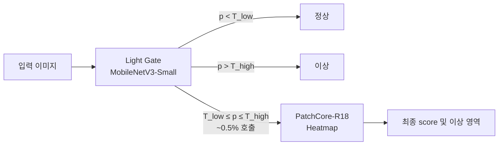
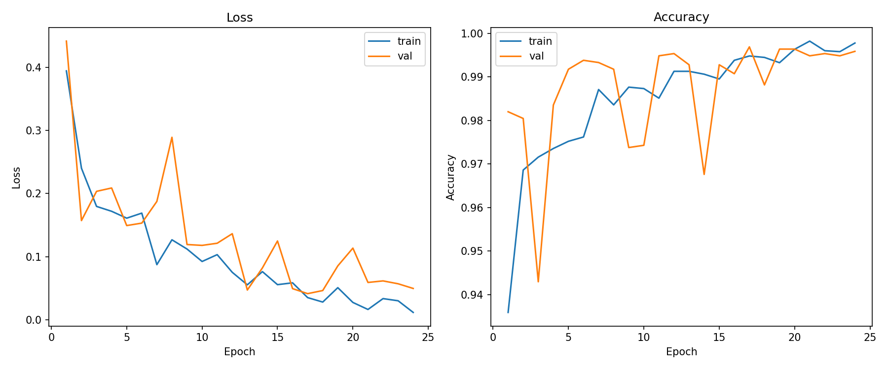
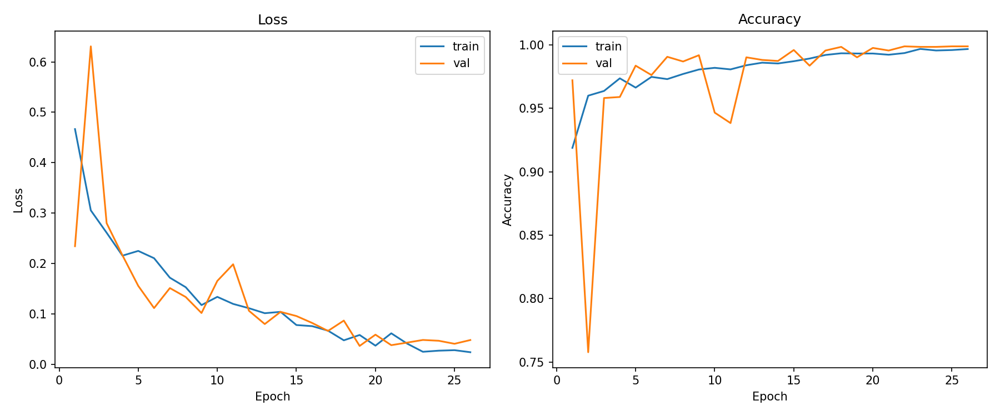
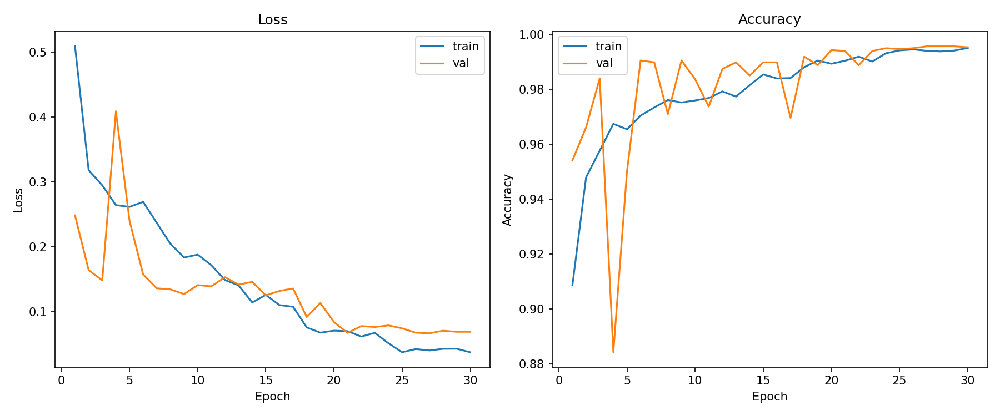

# Light Gate — MobileNetV3-Small 기반 1단계 경량 게이트

> 2단계 cascade의 1단계를 **MobileNetV3-Small**로 압축. 기존 EfficientNet-B0 게이트 대비 **~3× 빠른 end-to-end latency, F1 동등 이상**을 달성. 미팅 발표용 정리 문서 (2026-05-14).

---

## 1. 왜 cascade가 필요한가

표면 결함 탐지에서 단일 무거운 모델(PatchCore-only)을 모든 입력에 돌리면:

- 추론 시간이 입력 수에 비례해 선형 증가
- 분포 변화(v3 같이 어려운 셋)에서 **false positive가 폭증** — 예: v3 PatchCore-only F1=0.7157, FP=114
- 정상 샘플 ~80%를 무거운 모델에서 돌리는 것 자체가 비효율

→ **1단계 경량 게이트로 명확한 정상/이상을 즉시 결정**, 중간대(`T_low ≤ p ≤ T_high`)만 2단계 PatchCore에 위임.

## 2. 시스템 아키텍처



- **1단계 (Light Gate)**: `MobileNetV3-Small` 백본 + `Dropout(0.3)` + `Linear(1)` + `Sigmoid`. ~928k params, CPU 단일 추론 p50 ≈ 12.14 ms.
- **2단계 (Heatmap)**: PatchCore (ResNet-18, coreset 10%, k=9). 게이트가 애매하다고 판단한 입력에만 호출.
- **분기 임계값**: 운영값 `T_low=0.1, T_high=0.5`.

## 3. Light Gate (MobileNetV3-Small) 도입 배경

기존 SWcapstone 게이트 백본 옵션은 EfficientNet-B0(EFB0) / MobileNetV3-Large(MNV3-L)이었음. 본 실험은 **더 가벼운 MobileNetV3-Small(MNV3-S)** 도 1단계 역할에 충분한지 검증.

### 백본 비교 (CPU 단일 forward, 1 image, 1 thread)

| backbone | params | CPU ms (mean±std) | p50 |
|---|---:|---|---|
| efficientnet_b0 | 4,008,829 | 41.45±5.16 | 39.93 |
| **mobilenet_v3_small** | **927,585** | **12.31±2.55** | **12.14** |

→ params 4.3× 작고, forward 3.4× 빠름. 게이트는 사후 PatchCore 호출 비용을 줄이는 게 목적이므로 forward 자체가 가벼울수록 cascade 전체 이득.

### 구조 (`backend/src/gate_model.py` 참고)

```python
# backend/src/gate_model.py (요약)
_VALID_BACKBONES = (
    "efficientnet_b0",
    "mobilenet_v3_large",
    "mobilenet_v3_small",   # 본 실험에서 추가
)

# 헤드: features → Dropout(0.3) → Linear(in_features → 1) → Sigmoid
```

전체 모델: `Sequential(backbone, Sequential(Dropout(0.3), Linear(feat, 1)))`. 분류 head는 backbone classifier를 `Identity`로 치환한 뒤 별도 레이어로 부착.

### 학습 설정 (`configs/default.yaml`의 `gate.mnv3_small`)

| 항목 | 값 |
|---|---|
| pretrained | true (ImageNet) |
| input_size | 224 |
| batch_size | 32 |
| epochs | 30 (early stopping patience=7) |
| optimizer | AdamW |
| lr / weight_decay | 0.001 / 0.0001 |
| scheduler | cosine |
| pos_weight | auto (음성/양성 비) |
| freeze_backbone_epochs | 3 (warmup) |
| calibration | isotonic |
| AMP | 디바이스 지원 시 enabled |

학습 전략:

1. **백본 동결 → 해제 워밍업** 3 epoch — 헤드 안정화
2. `BCEWithLogitsLoss(pos_weight=auto)` — 불균형 보정
3. `AdamW` + `CosineAnnealingLR`
4. 검증 손실 7 epoch 개선 없으면 조기 종료, 최고 가중치 복원

## 4. 확률 보정 (Calibration)

게이트 sigmoid 출력은 학습 분포에 편향되어 있어 운영 분포에서 그대로 임계값으로 쓰면 오작동 가능. `GateModel.calibrate()`는 두 가지 후처리를 지원:

- **Platt scaling** — 로지스틱 회귀, 부드러운 보정
- **Isotonic regression** — 비모수 단조 보정 (본 실험 기본값)

학습 후 검증 셋의 (sigmoid, label) 쌍으로 보정기를 학습 → `.pkl`로 저장 (`models/v{1,2,3}_mnv3_small_calibrator.pkl`).

## 5. 임계값 결정 (Threshold Tuning)

`GateModel.threshold_sweep()` + `recommend_thresholds()`:

- T_low 후보: **recall ≥ 0.95 보장하는 최소값** (놓치면 안 되는 이상 표본 우선)
- T_high 후보: **FPR ≤ 0.10 보장하는 최대값**
- 두 값 사이가 PatchCore 위임 구간

**중요**: `configs/config.yaml` 기본값은 `T_low=0.3, T_high=0.7`이지만 본 벤치마크 및 `serve.py` 운영 코드는 **`T_low=0.1, T_high=0.5`** 사용. v1/v2/v3 셋에서 게이트 분리력이 매우 높아 더 공격적인 임계로 운용 가능 → Q&A 대비 (§9).

## 6. Cascade 동작 (`backend/src/serve.py` `/predict`)

```python
# 1단계: 게이트 추론
prob = gate.predict(img_tensor)        # sigmoid 확률, calibrator 적용 후

# 2단계 분기: 운영 임계값 적용
heatmap_res = (
    heatmap.predict(img_tensor)
    if (ensemble_enabled and prob > production_gate["T_low"] and heatmap_model)
    else None
)

# 최종 score 우선순위: heatmap > gate(앙상블 OFF시) > 0.0
score = (
    heatmap_res["anomaly_score"] if heatmap_res
    else (prob if not ensemble_enabled else 0.0)
)
decision = "anomaly" if score > 0.5 else "normal"
```

핵심:

1. 게이트 확률이 `T_low` 이하면 즉시 정상 결정, PatchCore 호출 없음
2. 그 이상이면 heatmap 호출 (PatchCore가 anomaly_score + 위치 정보 반환)
3. heatmap이 있으면 score는 heatmap 점수 우선

## 7. 벤치마크 결과

### 7-1. Cascade 비교: MNV3-Small vs EFB0 (eval = v{1,2,3}_balanced_test, 400장×3 run, CPU)

| version | gate | acc | f1 | recall | precision | latency ms (mean±std) | heatmap call rate |
|---|---|---|---|---|---|---|---|
| v1 | effnetb0 | 0.9900 | 0.9899 | 0.9800 | 1.0000 | 99.77±0.39 | 1.75% |
| v1 | **mnv3_small** | **0.9975** | **0.9975** | **0.9950** | **1.0000** | **33.02±1.73** | **0.00%** |
| v2 | effnetb0 | 0.9775 | 0.9772 | 0.9650 | 0.9897 | 103.27±0.68 | 2.50% |
| v2 | **mnv3_small** | **1.0000** | **1.0000** | **1.0000** | **1.0000** | **36.63±0.60** | **1.25%** |
| v3 | effnetb0 | 0.9825 | 0.9824 | 0.9750 | 0.9898 | 101.21±1.48 | 1.75% |
| v3 | **mnv3_small** | **1.0000** | **1.0000** | **1.0000** | **1.0000** | **34.39±0.28** | **0.25%** |

원본: [`reports/benchmark_light_gate_comparison.md`](../reports/benchmark_light_gate_comparison.md)

### 7-2. Cascade vs Baseline (PatchCore-only)

| version | pipeline | F1 | latency ms |
|---|---|---|---|
| v1 | baseline (PatchCore only) | 0.7955 | 71.34 |
| v1 | **gate_cascade (mnv3_small)** | **0.9975** | **33.02** |
| v2 | baseline | 0.7714 | 82.61 |
| v2 | **gate_cascade** | **1.0000** | **36.63** |
| v3 | baseline | 0.7157 | 95.08 |
| v3 | **gate_cascade** | **1.0000** | **34.39** |

원본: [`reports/benchmark_v1v2v3_balanced_mnv3small.md`](../reports/benchmark_v1v2v3_balanced_mnv3small.md)

### 7-3. End-to-end speedup (cascade path, MNV3-S vs EFB0)

| version | EFB0 ms | MNV3-S ms | speedup |
|---|---|---|---|
| v1 | 99.77 | 33.02 | **3.02×** |
| v2 | 103.27 | 36.63 | **2.82×** |
| v3 | 101.21 | 34.39 | **2.94×** |

### 7-4. 핵심 결론

- **정확도 동등 이상**: MNV3-S cascade F1 평균 0.9992 vs EFB0 cascade 0.9832
- **속도 ~2.9× 향상**: end-to-end 평균 34.68 ms vs 101.42 ms
- **Heatmap 호출률 0.50%** (EFB0의 2.00% 대비 1/4) — 게이트 분리력이 더 깨끗
- 결론: 1단계 게이트는 **MNV3-Small로 충분**. EFB0/MNV3-Large는 더 깊은 2차 판단이 필요할 때 옵션으로 보유.

### 7-5. 데이터 버전별 학습 곡선 / ROC / PR / CM





(전체 그림은 `reports/assets/v{1,2,3}_mnv3_small_test_{roc,pr,cm}.png` 참조)

## 8. 운영 흐름 (MLOps)

- 모델 hot-swap (`POST /mlops/deploy`) — production gate/heatmap 메모리 교체, downtime 없이 버전 교체
- 피드백 수집 (`POST /mlops/feedback`) — 운영 중 잘못 분류된 이미지를 수집
- 재학습 (`POST /mlops/train`) — `training_recipes.json`의 3가지 CPU 레시피 중 선택 (Balanced / Fast Smoke / Low-LR Recovery)
- 라운드 단위 모델 (`round{1,2,3}_*.pt`) — 데이터 누적 성능 추적

## 9. Q&A 대비

- **Q. 왜 MNV3-Small까지 줄였나?**
  - 1단계 게이트의 본질은 "확실한 정상/이상의 빠른 short-circuit". 분리력만 충분하면 백본은 가벼울수록 cascade 전체 이득. v1/v2/v3 셋에서 분리력 검증 완료.

- **Q. 정확도-지연 trade-off?**
  - 본 실험에서는 **trade-off가 거의 없음**. MNV3-S가 EFB0 대비 정확도 동등 이상이고 속도 3× — 이 데이터셋 한정으로는 명확한 우위. 분포가 더 어려운 미래 데이터에서는 EFB0/MNV3-L로 복귀 옵션 보유.

- **Q. `T_low=0.1`로 낮춘 이유?**
  - 운영에서 재현율을 최우선. 게이트가 0.1보다 낮은 확률을 준 입력은 PatchCore에 보내봤자 정상으로 결론날 확률 매우 높음. 호출률 상한 50% 제약 안에서 운영 보정.

- **Q. `configs/config.yaml`은 T_low=0.3, T_high=0.7인데 운영은 0.1/0.5인가?**
  - 운영 임계는 `serve.py`의 `production_gate` 상태로 별도 관리. config 기본값은 학습 시 권장값. 데이터 라운드별 `threshold_sweep` 결과에 따라 운영값이 갱신됨.

- **Q. Heatmap 호출률이 0.5%면 PatchCore 학습/유지 가치가 있나?**
  - 호출률이 낮을수록 cascade가 잘 작동한다는 뜻 (게이트가 대부분 처리). 0.5%는 어려운 케이스이므로 그 때만큼은 위치 정보(heatmap)가 발표/검수/오류 분석에 가치 있음. 또한 분포가 변하면 호출률이 다시 오를 수 있어 PatchCore는 안전망으로 유지.

- **Q. checkpoint load 버그 이슈?**
  - 초기에 cascade F1≈0이 나왔는데 원인은 `gate_model.py`의 키 리매핑 오류 (`classifier.*` → `0.classifier.*`로 잘못 부착). 본 브랜치에서 수정: `classifier.*` → `1.{rest}` (Sequential 두 번째 모듈인 헤드 Linear로 정확히 매핑). 자세한 내용은 `reports/NOTION_2026-05-07_gate_load_fix.md`.

## 10. 재현 방법

```bash
# 학습 (v1/v2/v3 PatchCore + Gate)
bash scripts/train_all_v123.sh

# 벤치마크 (mnv3_small cascade)
python scripts/benchmark_pipeline.py \
  --versions v1 v2 v3 \
  --test-csv splits_eval/v{1,2,3}_balanced_test.csv \
  --gate-model models/v{1,2,3}_mnv3_small_gate.pt \
  --gate-calib models/v{1,2,3}_mnv3_small_calibrator.pkl \
  --patchcore-model models/v{1,2,3}_patchcore_r18_patchcore.pt \
  --t-low 0.1 --t-high 0.5 \
  --device cpu \
  --output reports/benchmark_v1v2v3_balanced_mnv3small.json
```

> 위 스크립트와 weights는 본 브랜치에 모두 포함되지는 않음 (대용량 바이너리 제외). dhscapstone `lightgate` 브랜치에서 동기화 필요.

## 11. 관련 파일

| 파일 | 역할 |
|---|---|
| `backend/src/gate_model.py` | `GateModel` — MNV3-Small 백본 옵션 추가, load() 키 리매핑 수정 |
| `configs/config.yaml`, `configs/default.yaml` | `gate.mnv3_small` 설정 블록 추가 |
| `reports/benchmark_light_gate_comparison.md` | MNV3-S vs EFB0 cascade 비교 |
| `reports/benchmark_v1v2v3_balanced_mnv3small.md` | MNV3-S cascade vs baseline 비교 |
| `reports/benchmark_v1v2v3_balanced_comparison.md` | 벤치마크 비교 추가 분석 |
| `reports/NOTION_2026-05-07_v123_pipeline_benchmark.md` | EFB0 cascade 1차 결과 + 분석 |
| `reports/NOTION_2026-05-07_gate_load_fix.md` | load 버그 수정 보고 |
| `reports/assets/v{1,2,3}_mnv3_small_*.png` | training/test ROC/PR/CM 시각화 |
| `reports/light_gate_logs/load_and_latency.json` | per-image latency raw 측정 |
